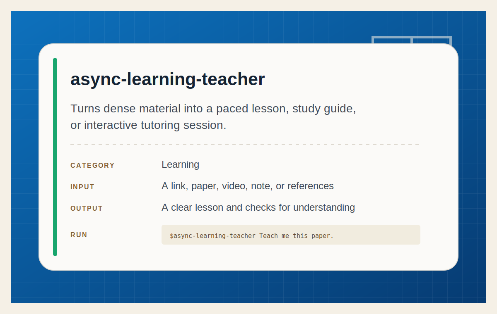

# Async Learning Teacher

<p align="center">
  
</p>

## Install

Install this skill for your user account:

```bash
npx @tamng0905/builder-essential-skills --skill async-learning-teacher
```

Install it into the current repository instead:

```bash
npx @tamng0905/builder-essential-skills --skill async-learning-teacher --project
```

Restart Claude Code or Codex after installation, then ask it to teach you a
saved link, paper, article, post, video, or reference collection.

A portable agent skill for turning saved links, papers, articles, posts, videos, and reference collections into approachable teaching artifacts for later study.

## What It Does

Async Learning Teacher helps you queue interesting resources now and learn from them later. Instead of saving raw links that are hard to restart from, the agent converts them into readable explanations, study notes, or interactive tutoring checkpoints.

It supports two learning modes:

## Quick Teaching

Use this for a single link, paper, blog post, tweet thread, video, or small source set.

The agent creates a complete teaching artifact in one pass:

- Why the resource matters
- Prerequisites
- Step-by-step chapter-style explanation
- Subtle points and examples
- What to remember
- Follow-up questions
- Validation gaps

Example prompt:

```text
Use $async-learning-teacher to teach me this paper:
https://arxiv.org/abs/...
