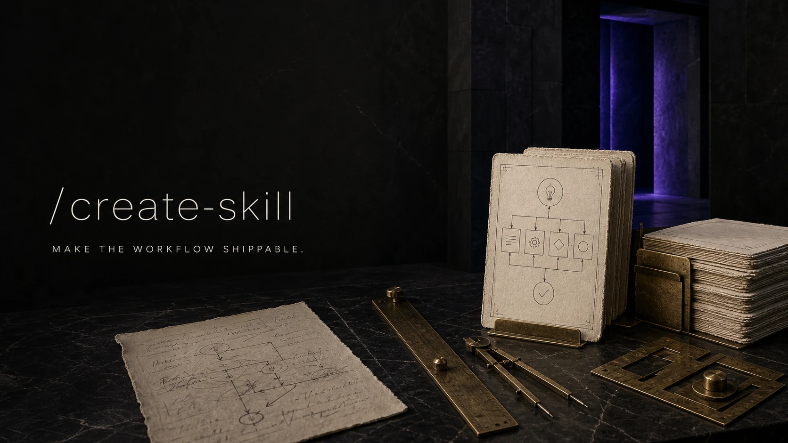

# Create Skill

  

Create a complete, discoverable skill from an idea: instructions, references,
metadata, skill-card artwork, README wiring, and validation.

See the full workflow in [SKILL.md](SKILL.md), including the cinematic artwork
guide in [references/artwork.md](references/artwork.md).
