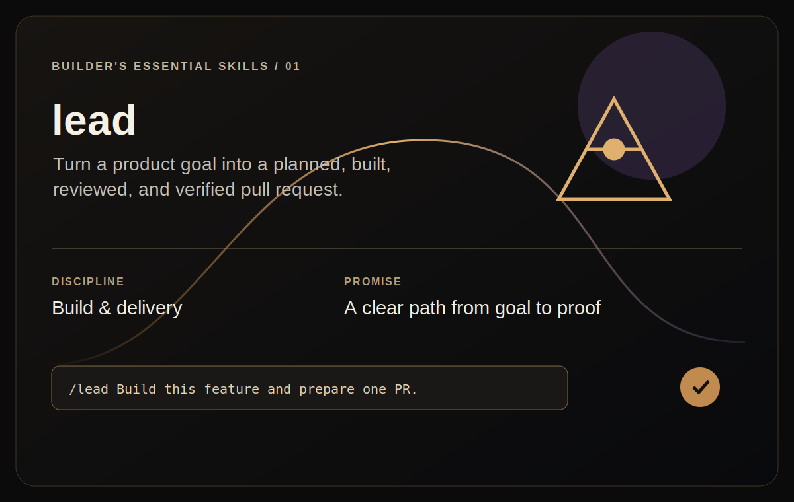

# Lead

<p align="center">
  
</p>

Run the autonomous build factory: turn a goal into an approved plan, freeze
acceptance checks, dispatch parallel builders, review their work, and finish
with a single pull request.

## Install

Install this skill and its supporting builder/reviewer agents for your user
account:

```bash
npx @tamng0905/builder-essential-skills --skill lead
```

Install them into the current repository instead:

```bash
npx @tamng0905/builder-essential-skills --skill lead --project
```

Restart Claude Code or Codex, then invoke it with `/lead` or ask for an
autonomous build run.

See the full workflow in [SKILL.md](SKILL.md).
