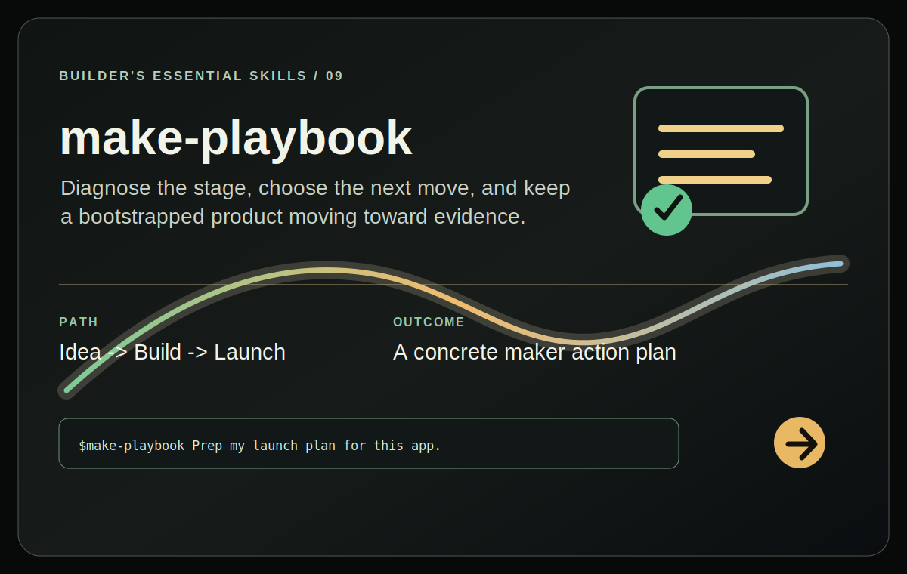

# MAKE Playbook

<p align="center">
  <a href="SKILL.md"></a>
</p>

Diagnose a bootstrapped app by stage: idea, build, launch, grow, monetize,
automate, or exit. The skill turns the relevant checklist into a concrete plan
for the user's actual product and can maintain a per-app `MAKE.md` tracker.

## Install

Install this skill for your user account:

```bash
npx @tamng0905/builder-essential-skills --skill make-playbook
```

Install it into the current repository instead:

```bash
npx @tamng0905/builder-essential-skills --skill make-playbook --project
```

Restart Claude Code or Codex, then ask about an app idea, launch, growth,
pricing, automation, or acquisition decision.

See the full workflow in [SKILL.md](SKILL.md).
