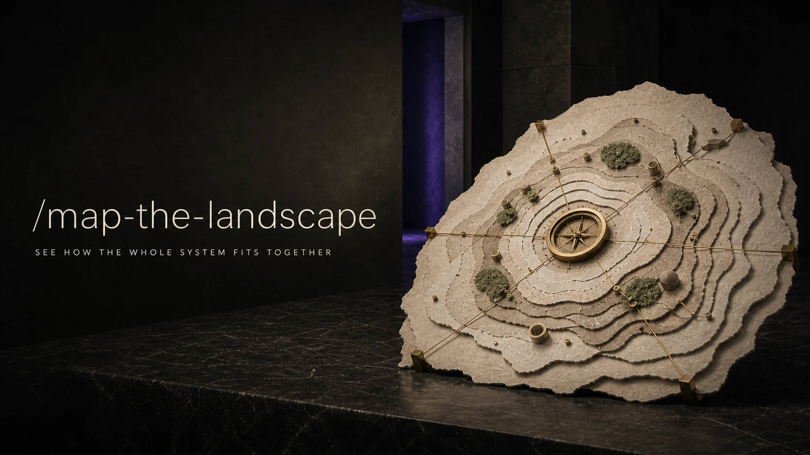

# Map the Landscape

<p align="center">
  <a href="SKILL.md"></a>
</p>

Turn an unfamiliar topic or repository into a clear mental model of its
boundaries, layers, actors, components, relationships, flows, history, fault
lines, and open questions.

## Install

Install this skill for your user account:

```bash
npx @tamng0905/builder-essential-skills --skill map-the-landscape
```

Install it into the current repository instead:

```bash
npx @tamng0905/builder-essential-skills --skill map-the-landscape --project
```

Restart Claude Code or Codex, then ask for the big picture of a field,
technology, ecosystem, architecture, or codebase.

See the full workflow in [SKILL.md](SKILL.md) and the mode-specific lenses in
[references/map-lenses.md](references/map-lenses.md).
