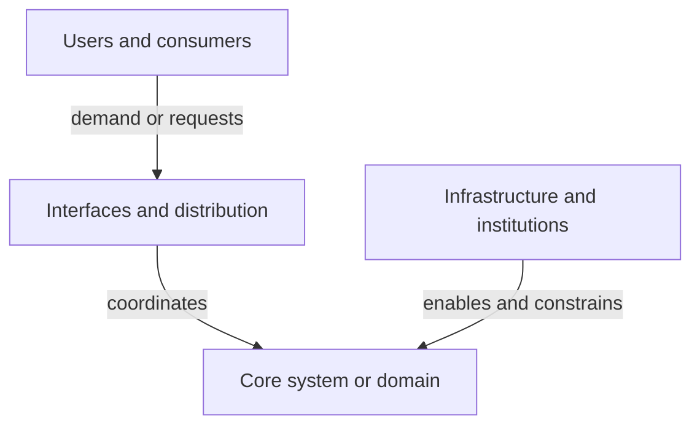
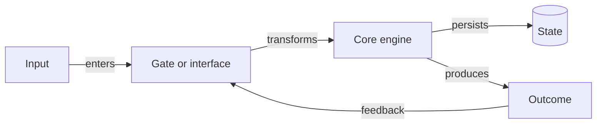
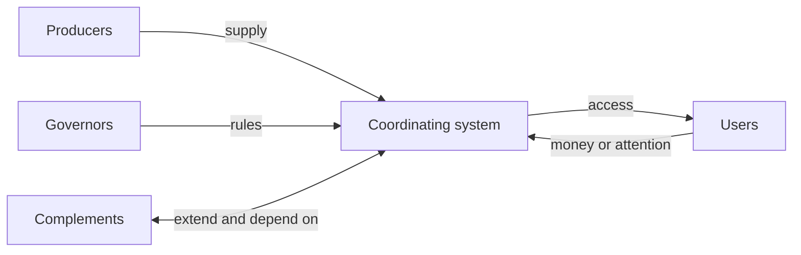

# Landscape Lenses and Templates

Use this reference selectively. Choose the smallest set of lenses that exposes
the subject's structure; do not turn every lens into a mandatory section.

## Contents

- [Topic lenses](#topic-lenses)
- [Repository lenses](#repository-lenses)
- [Evidence targets](#evidence-targets)
- [Diagram patterns](#diagram-patterns)
- [Standard output template](#standard-output-template)
- [Quality test](#quality-test)

## Topic Lenses

### Domain Shape

- What central problem or need defines the domain?
- What are the major subdomains, and where are their boundaries disputed?
- Which terms are synonyms, overloaded, or commonly confused?
- What is foundational, and what is merely popular now?

### Actors and Power

- Who creates, operates, funds, governs, distributes, buys, and uses?
- Who sets standards or controls access?
- Where do incentives align or conflict?
- Who bears costs, captures value, or absorbs risk?

### Artifacts and Institutions

- What products, protocols, standards, datasets, papers, regulations, or
  communities organize the field?
- Which are substitutes, complements, layers, or interfaces?
- What makes a central artifact hard to replace?

### Flows and Feedback

- How do information, money, materials, authority, attention, or risk move?
- Where are the gates, queues, bottlenecks, and feedback loops?
- Which metrics change behavior?
- What becomes more valuable as adoption grows?

### Evolution and Fault Lines

- Which earlier model did the current one replace or extend?
- Which technical, economic, legal, or social event changed the field?
- Which schools disagree, and what assumptions produce the disagreement?
- What is consolidating, fragmenting, commoditizing, or emerging?

## Repository Lenses

### Purpose and Boundary

- Who uses the system, and what job do they ask it to perform?
- Which guarantees or invariants define success?
- What is owned here versus delegated to libraries, services, or operators?

### Runtime Shape

- What processes, services, workers, jobs, clients, or packages exist?
- Where does execution begin?
- What calls what, synchronously or asynchronously?
- Where are retries, queues, caches, and failure boundaries?

### Data and State

- Which data enters, changes, persists, and leaves?
- What is the source of truth?
- Which schemas and migrations encode long-lived decisions?
- Where are consistency, privacy, or retention enforced?

### Interface and Ownership

- What APIs, commands, events, files, or user interfaces form public contracts?
- Which module owns each policy decision?
- Where do boundaries leak or responsibilities overlap?
- Which tests demonstrate the intended contract?

### Build and Operations

- How does source become a running system?
- Which generated artifacts, environments, secrets, and external platforms are
  involved?
- How is health observed, and how does failure surface?
- Which local workflow differs from production?

### Evolution and Risk

- Which recent changes reveal the direction of travel?
- Where are compatibility layers or migrations active?
- Which central component has weak tests, implicit coupling, or concentrated
  knowledge?
- Which dependency or service creates the largest external constraint?

## Evidence Targets

Use these as likely evidence, not a rote reading list.

| Question | Strong repository evidence | Strong topic evidence |
| --- | --- | --- |
| What is it for? | README, entry points, end-to-end tests | canonical definitions, standards |
| What are the parts? | manifests, top-level modules, deployment config | taxonomies, primary projects |
| How do they connect? | imports, calls, schemas, events, integration tests | specifications, partnerships, supply chains |
| What is enforced? | code paths, constraints, tests | regulation, governance, protocols |
| How did it change? | history, migrations, architecture notes | dated primary sources, papers, releases |
| What is uncertain? | unfinished work markers, missing tests, divergent docs/code | disputed evidence, missing data, competing models |

## Diagram Patterns

Choose one dominant geometry.

**Layer map:** useful for platforms and technical stacks.



**Flow map:** useful when transformation matters more than hierarchy.



**Ecosystem map:** useful for actors and value exchange.



Use concrete names and explicit relationship labels in the final diagram.
Avoid crossing edges where a short prose explanation is clearer.

## Standard Output Template

```markdown
# [Subject] Landscape

## The Picture in One Minute
[One-sentence mental model and short explanation.]

## Boundary and Vocabulary
- In scope:
- Adjacent:
- Out of scope:
- Terms that matter:

## Landscape Map
[Readable Mermaid diagram.]

## How the Pieces Fit Together
| Part or actor | Role | Connects to | Why it matters |
| --- | --- | --- | --- |

## The Most Important Flow
[Trace one flow end to end, including gates and failure points.]

## How It Got Here
[Only the history that explains the present.]

## Fault Lines and Blind Spots
- Tradeoff or disagreement:
- Bottleneck or risk:
- Boundary effect:

## Where to Look Next
1. [First concept, file, or source and why.]
2. [Second.]
3. [Third.]

Representative flow to trace:
Common misconception:
Question worth investigating:

## Evidence and Unknowns
- Observed:
- Sourced:
- Inferred:
- Unknown:
```

## Quality Test

A reader should be able to answer all five:

1. What is the center of this system?
2. What are its major layers or actors?
3. What moves between them?
4. Why does the current structure look this way?
5. Where should I zoom in next?

If the answer is only a list of names, rebuild the relationships. If the answer
has no boundary or unknowns, narrow its claims. If the diagram cannot be
explained in two short paragraphs, simplify it.
