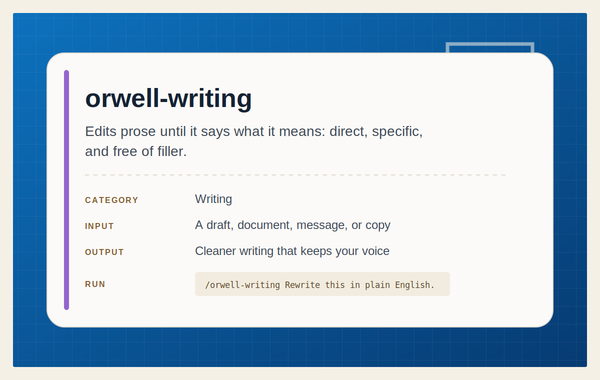

# Orwell Writing

<p align="center">
  
</p>

Draft, revise, and polish prose in plain English while preserving the intended
meaning, voice, audience, and genre.

## Install

Install this skill for your user account:

```bash
npx @tamng0905/ai-agent-skills --skill orwell-writing
```

Install it into the current repository instead:

```bash
npx @tamng0905/ai-agent-skills --skill orwell-writing --project
```

Restart Claude Code or Codex, then ask it to draft, edit, simplify, or
humanize a piece of writing.

See the full workflow in [SKILL.md](SKILL.md).
