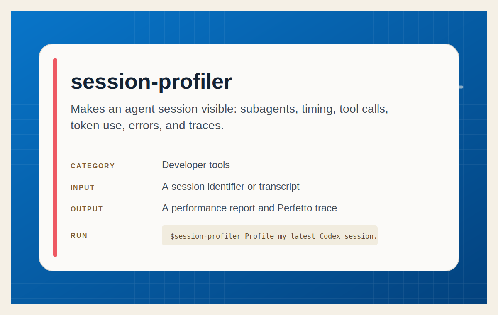

# Session Profiler

<p align="center">
  
</p>

Inspect Claude Code and Codex session transcripts, summarize agent activity,
break down time, tools, tokens, and estimated cost, and export Perfetto traces.

## Install

Install this skill for your user account:

```bash
npx @tamng0905/builders-essential-skills --skill session-profiler
```

Install it into the current repository instead:

```bash
npx @tamng0905/builders-essential-skills --skill session-profiler --project
```

Restart Claude Code or Codex. Python 3 is required for the profiler's bundled
tools; see [SKILL.md](SKILL.md) for usage and transcript details.
