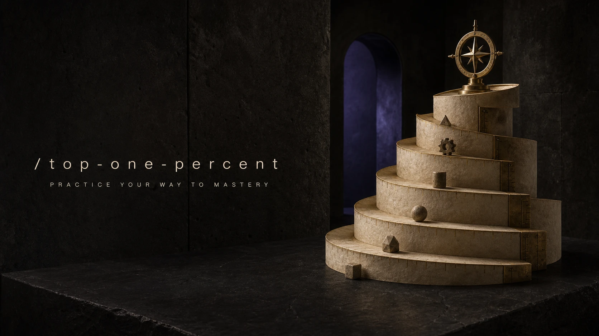

# Top One Percent

<p align="center">
  <a href="SKILL.md"></a>
</p>

## Install

Install this skill for your user account:

```bash
npx @tamng0905/builder-essential-skills --skill top-one-percent
```

Install it into the current repository instead:

```bash
npx @tamng0905/builder-essential-skills --skill top-one-percent --project
```

Restart Claude Code or Codex, then use it to build a rigorous path through any
field, subtopic, or concept.

## What It Does

Top One Percent turns a learning ambition into an adaptive mastery system. It
maps the domain, identifies what exceptional practice looks like, teaches the
relevant foundations, and then uses deliberate practice, feedback, and
capstones to build demonstrable skill. Its lesson loops use research-informed
retrieval, spacing, worked-example fading, calibration, and transfer checks
rather than treating passive reading as progress.

It does not promise that a learner can be ranked in a literal top one percent.
Instead, it makes the goal operational: define the target performance and use
credible evidence to show growing capability.

Example:

```text
Use $top-one-percent to help me become exceptional at product analytics.
I know basic SQL, have five hours each week, and want to lead a real analysis
project in six months.
```

The result includes a domain map, a staged curriculum, practice loops,
assessments, resources that earn their place, and a realistic capstone.
