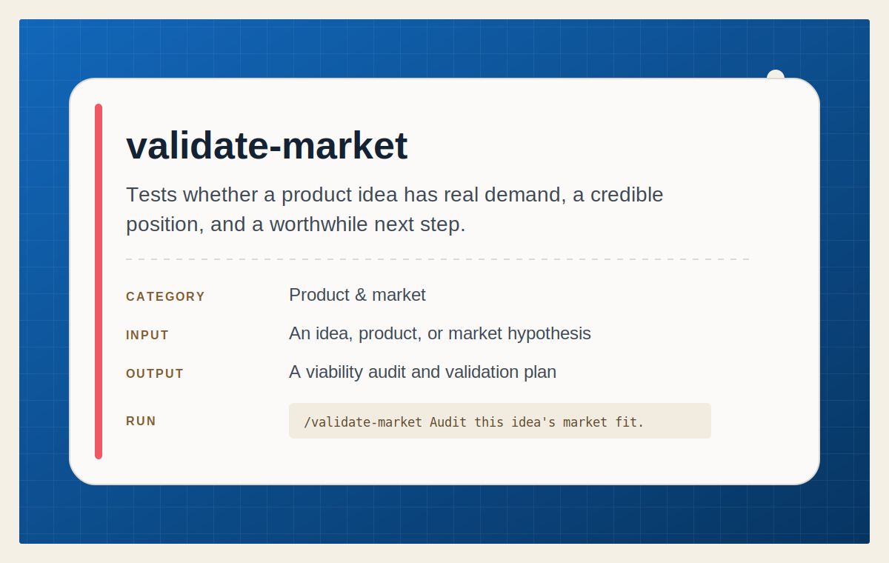

# Validate Market

<p align="center">
  
</p>

Run an honest market-fit and viability audit that compares competitors, tests
the case for the idea, and ends with clear pass, middle, or kill criteria.

## Install

Install this skill for your user account:

```bash
npx @tamng0905/ai-agent-skills --skill validate-market
```

Install it into the current repository instead:

```bash
npx @tamng0905/ai-agent-skills --skill validate-market --project
```

Restart Claude Code or Codex, then ask it to audit a product, market, or
business idea before you invest more time.

See the full workflow in [SKILL.md](SKILL.md).
