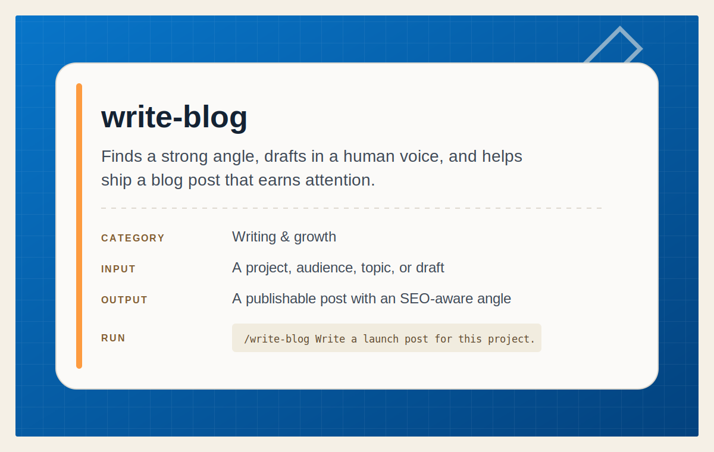

# Write Blog

<p align="center">
  
</p>

Write and ship a human-sounding blog post that targets search traffic, avoids
keyword cannibalization, and connects the finished post to the project site.

## Install

Install this skill for your user account:

```bash
npx @tamng0905/builders-essential-skills --skill write-blog
```

Install it into the current repository instead:

```bash
npx @tamng0905/builders-essential-skills --skill write-blog --project
```

Restart Claude Code or Codex, then ask it to draft, edit, or publish a blog
post for the project.

See the full workflow in [SKILL.md](SKILL.md).
